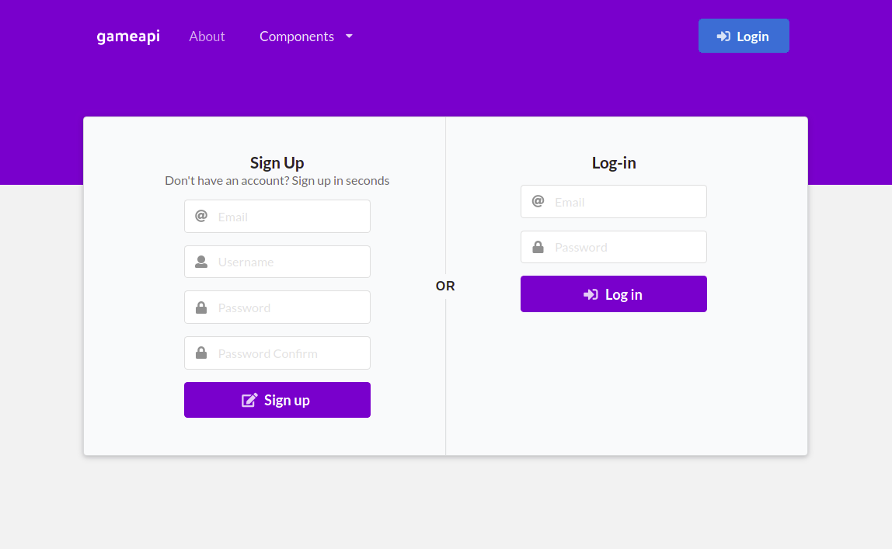
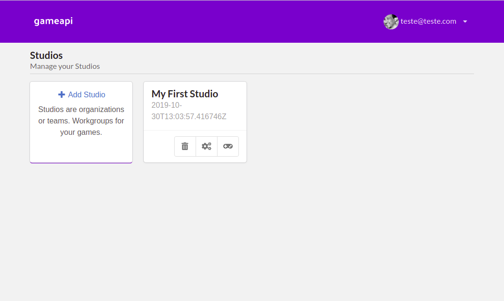
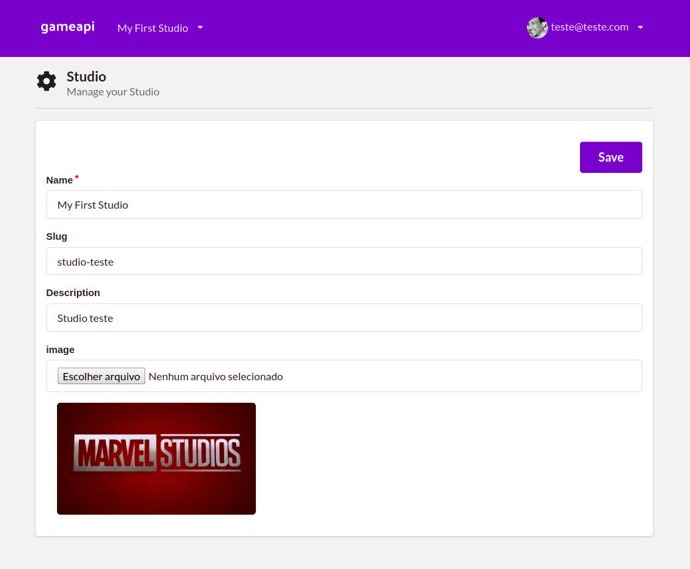
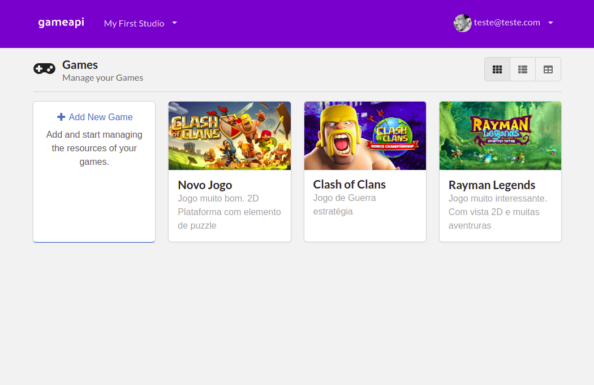
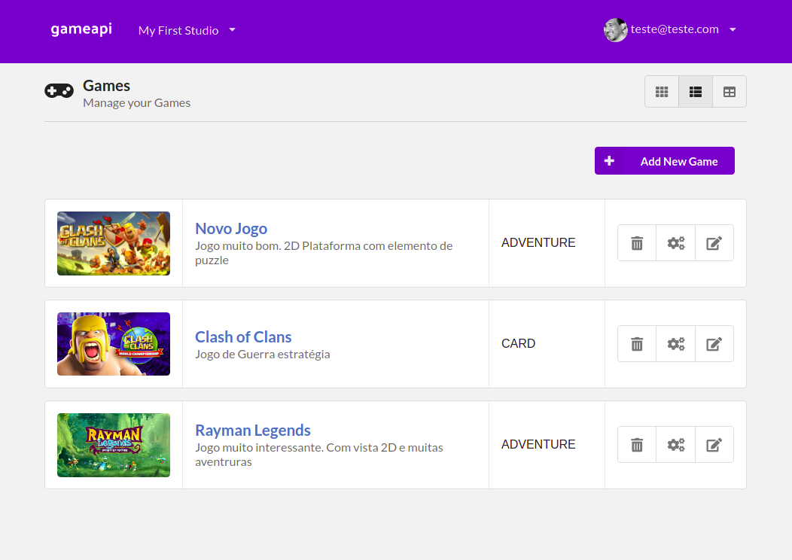
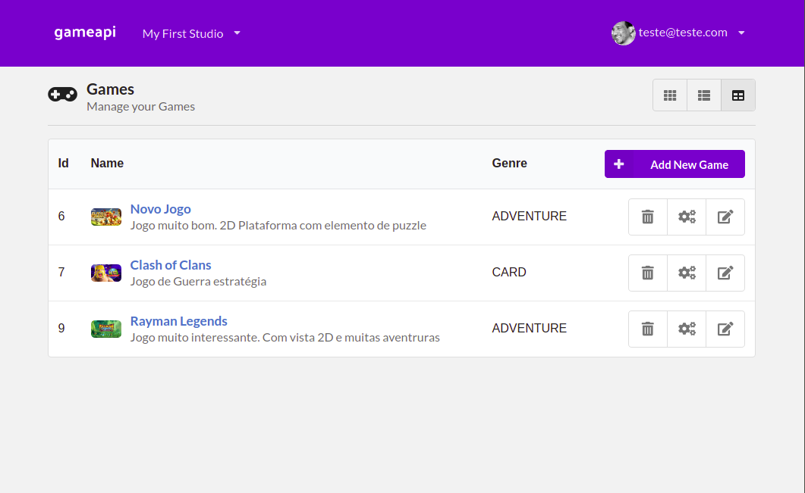
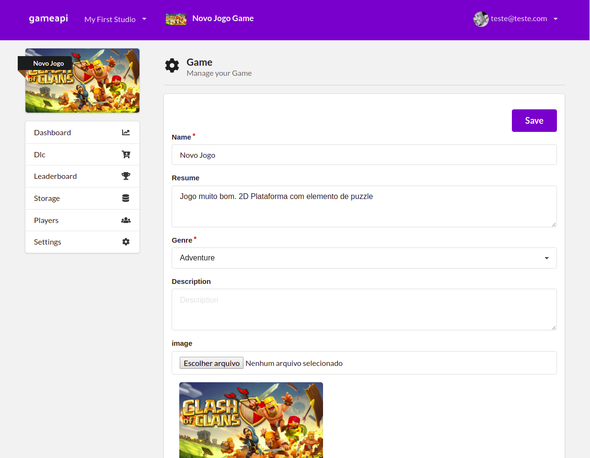

# React Admin Client for GameApi

### A light backend platform for indie game developers.

Use an API to manage game services and configure metadata to authorize and authenticate your game. Integrate popular features into your Mobile, Web and Desktop games using as our API.

*Author:* Apoena Machado Cunha
*Demo:* https://apoenamachado.github.io/gameapi-admin-react/

## Modules

- User Accounts
- Studios
- Leaderboards
- DLC
- Data Storage
- Players

## Login/Registration

## Studios
Create studios (organization) and register the games independently.

### List

### Settings

## Games

### List

#### Grid

#### List

#### Table

### Settings

